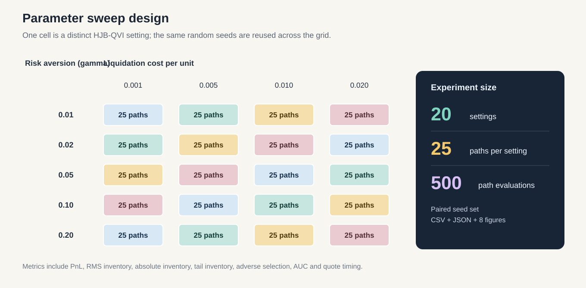
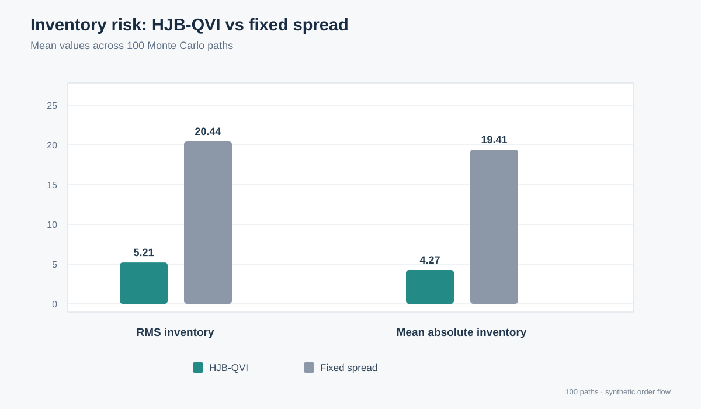
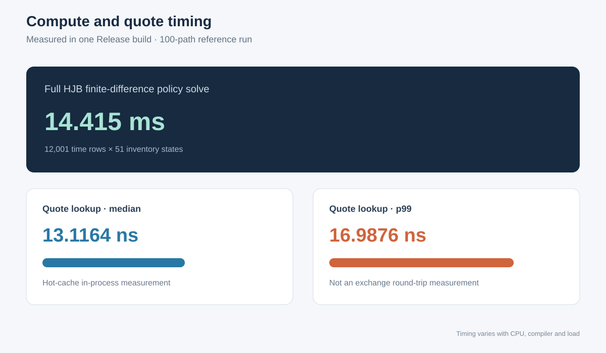
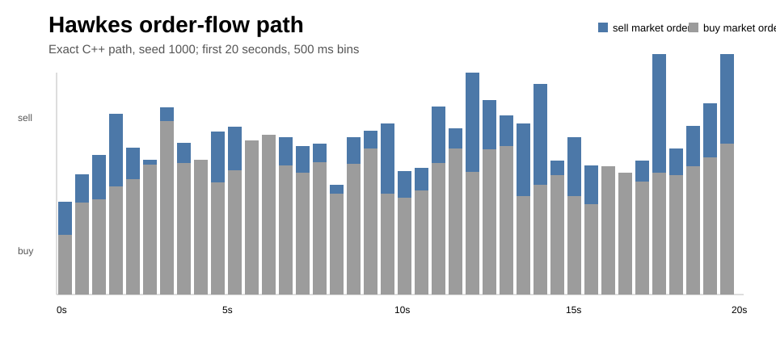
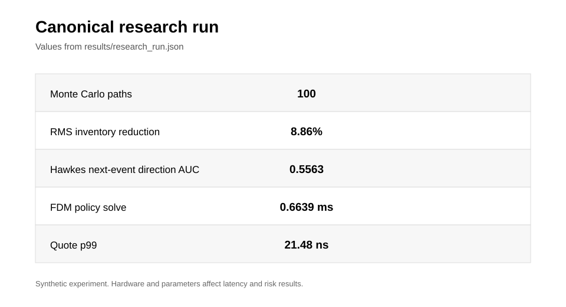
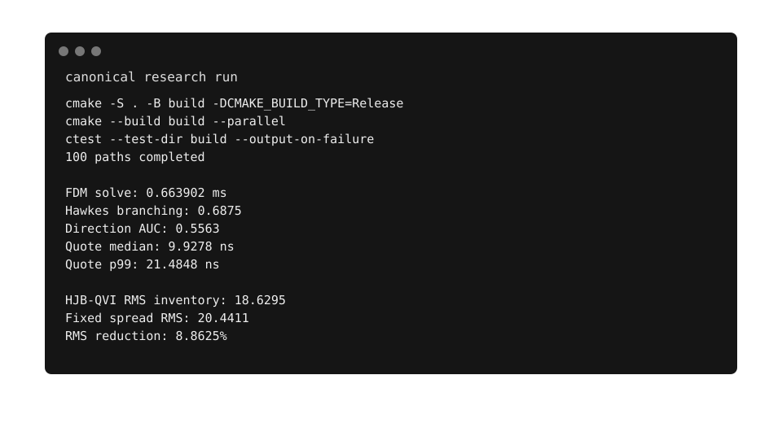
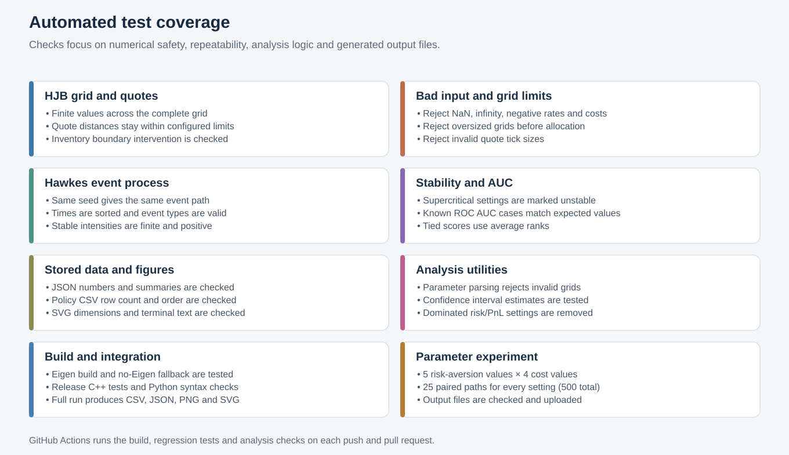

# Stochastic Market Maker

**Author:** Pirate-Emperor

This repository contains a C++/Python implementation of a stochastic market-making experiment built around three pieces:

1. inventory control with a reduced-state HJB-QVI,
2. clustered buy/sell order flow from a bivariate exponential Hawkes process, and
3. a precomputed C++ finite-difference policy with a small quote-generation path.

The default experiment is synthetic and does not require market-data files, API keys, exchange credentials, or external services.

## Contents

- [What is implemented](#what-is-implemented)
- [Requirements](#requirements)
- [Run it from a clean clone](#run-it-from-a-clean-clone)
- [Run the research experiment](#run-the-research-experiment)
- [Run a parameter sweep](#run-a-parameter-sweep)
- [Open the local dashboard](#open-the-local-dashboard)
- [Outputs](#outputs)
- [Canonical experiment](#canonical-experiment)
- [Figures](#figures)
- [Model](#model)
- [Project structure](#project-structure)
- [Tests and CI](#tests-and-ci)
- [Troubleshooting](#troubleshooting)
- [Scope and limitations](#scope-and-limitations)

## What is implemented

### Inventory control

The research path solves a finite-horizon inventory-control problem on an integer inventory grid.

The state is

`(t, q)`

where `q` is inventory. The controller chooses the bid and ask quote distances.

The synthetic fill model is

`lambda(delta) = A * exp(-k * delta)`.

The continuation operator includes inventory risk

`-0.5 * gamma * sigma^2 * q^2`.

The QVI compares continuation with an intervention value that liquidates inventory at a configurable cost. At the inventory boundary, intervention is also enabled.

The numerical solution is stored as a time-by-inventory table. The online quote path only performs indexing, clamping and arithmetic.

### Hawkes order flow

The simulator uses two event types:

- `0` = sell market order / bid hit
- `1` = buy market order / ask lift

The intensity of each side is

`lambda_i(t) = mu_i + sum_j alpha_ij * sum_k exp(-beta * (t - tau_k))`.

Same-side and cross-side excitation are kept separate. This allows the simulator to produce bursts of activity rather than independent Poisson arrivals.

The integrated kernel matrix is `K = alpha / beta`. Its spectral radius is used as the branching ratio. With Eigen3 installed, the 2 x 2 spectral radius is evaluated with Eigen; the project also contains a closed-form fallback, so Eigen is not required for the basic build.

### Finite-difference and quote path

The HJB solution is computed by backward time stepping over the inventory grid.

The hot inventory loop is annotated with:

```cpp
#pragma omp simd
```

GCC and Clang builds use optimization flags suitable for the benchmark path. `-march=native` can be disabled with:

```text
-DSMM_NATIVE_OPT=OFF
```

The FDM solve and the online quote lookup are benchmarked separately. The latter is not a claim about exchange connectivity or end-to-end trading latency.

## Requirements

The supported research path uses:

- CMake 3.18 or newer
- a C++20 compiler
- Python 3.10 or newer for the Python runner and dashboard
- Eigen3 is recommended, but the C++ research binary has a fallback and can build without it
- matplotlib and NumPy for the report generation
- Streamlit only if the local dashboard is required

No data download is required for the default experiment.

### Ubuntu / Debian

Install the build tools and Python environment:

```bash
sudo apt update
sudo apt install -y build-essential cmake python3 python3-venv python3-pip libeigen3-dev
```

### macOS

Install the Apple command-line tools first if they are not already present:

```bash
xcode-select --install
```

Then install the remaining tools with Homebrew:

```brew install cmake eigen python
```

### Windows

Install Visual Studio 2022 with the **Desktop development with C++** workload.

Also install Python 3.10+.

CMake is included with current Visual Studio installations. Eigen is optional for the research executable; installing Eigen separately is useful when the Eigen-backed spectral-radius path is required.

## Run it from a clean clone

The following is the complete C++ path. It does not depend on the legacy code under `smmSrc/`, `includes/`, or `smmPython/`.

### Linux / macOS

Clone the repository and enter it:

```bash
git clone https://github.com/SpryzenHell/stochastic_mm.git
cd stochastic_mm
```

Configure the Release build:

```bash
cmake -S . -B build -DCMAKE_BUILD_TYPE=Release
```

Build:

```bash
cmake --build build --parallel
```

Run the tests:

```bash
ctest --test-dir build --output-on-failure
```

Run the C++ research executable:

```bash
./build/research/smm_research 100 results/run_100
```

The first argument is the number of Monte Carlo paths. The second argument is the output directory.

### Windows

Clone the repository:

```powershell
git clone https://github.com/SpryzenHell/stochastic_mm.git
cd stochastic_mm
```

Generate a Visual Studio build:

```powershell
cmake -S . -B build -G "Visual Studio 17 2022" -A x64
```

Build the Release configuration:

```powershell
cmake --build build --config Release --parallel
```

Run the tests:

```powershell
ctest --test-dir build -C Release --output-on-failure
```

Run the research executable:

```powershell
build\research\Release\smm_research.exe 100 results\run_100
```

## Run the research experiment

The Python script is the recommended way to reproduce the complete report because it also generates the figures.

Create a virtual environment.

Linux / macOS:

```bash
python3 -m venv .venv
source .venv/bin/activate
python -m pip install --upgrade pip
python -m pip install -r python/requirements.txt
```

Windows PowerShell:

```powershell
py -3 -m venv .venv
.\.venv\Scripts\Activate.ps1
python -m pip install --upgrade pip
python -m pip install -r python\requirements.txt
```

Run the complete experiment:

```bash
python scripts/run_research.py --runs 100 --output results/run_100
```

The script:

1. configures the CMake project,
2. builds the research targets,
3. runs CTest,
4. runs the C++ research executable,
5. reads the generated JSON/CSV files,
6. writes the Python summary, and
7. creates the report figures.

The build can be reused with:

```bash
python scripts/run_research.py --runs 100 --output results/run_100 --skip-build
```

A custom CMake build directory can be selected with:

```bash
python scripts/run_research.py --runs 100 --output results/run_100 --build-dir build_release
```

For a first check, 10 paths are enough:

```bash
python scripts/run_research.py --runs 10 --output results/smoke_test
```

For the reference experiment, use 100 paths.

## Run a parameter sweep

A parameter sweep checks how risk aversion and liquidation cost affect inventory risk and PnL. The default grid has 20 settings and runs 25 paths per setting (500 paths total). The same seed set is used for every setting, so each setting is tested against the same simulated event paths.

```bash
python scripts/run_sensitivity.py --runs 25 --gamma-values 0.01,0.02,0.05,0.10,0.20 --liquidation-costs 0.001,0.005,0.010,0.020 --output results/sensitivity
```

The script writes a CSV table, a JSON report with confidence intervals, three heatmaps, and a PnL-versus-inventory-risk plot. The confidence intervals are estimates, not guarantees. All scenarios use synthetic order flow; timing results depend on the machine.

<p align="center">
  
</p>

## Open the local dashboard

The repository also contains a small Streamlit dashboard for inspecting a completed run.

Start it with:

```bash
streamlit run python/dashboard.py
```

The sidebar accepts the results directory. For example, after running:

```bash
python scripts/run_research.py --runs 100 --output results/run_100
```

enter:

```text
results/run_100
```

The dashboard reads only files already produced by the experiment. It does not fetch market data or call a remote service.

The dashboard shows:

- the inventory-control summary,
- the HJB-QVI quote policy,
- the HJB-QVI versus fixed-spread comparison,
- the Hawkes event path, and
- the raw JSON record for the selected run.

## Outputs

A fresh run creates files such as:

```text
results/run_100/
├── research_run.json
├── python_summary.json
├── policy_t0.csv
├── sample_hawkes_events.csv
├── policy_skew.png
├── inventory_comparison.png
├── latency_benchmark.png
├── hawkes_events.png
└── terminal_snapshot.svg
```

### What each file contains

| File | Contents |
| --- | --- |
| `research_run.json` | Complete numerical result of the C++ run |
| `python_summary.json` | Small set of derived summary metrics |
| `policy_t0.csv` | Bid/ask quote distances for every inventory value at `t = 0` |
| `sample_hawkes_events.csv` | Exact C++ Hawkes path for seed 1000 |
| `policy_skew.png` | HJB-QVI bid/ask distance versus inventory |
| `inventory_comparison.png` | Mean RMS inventory comparison |
| `latency_benchmark.png` | FDM and quote-path timing measurements |
| `hawkes_events.png` | Hawkes event timeline |
| `terminal_snapshot.svg` | Large-text SVG summary written from the run JSON |

The checked-in files under `results/` are the reference artifacts. A new experiment should normally be written to another directory such as `results/run_100` so that the reference results are not overwritten.

## Canonical experiment

The reference configuration is stored in [`configs/research_default.json`](configs/research_default.json).

The main parameters are:

| Parameter | Value |
| --- | ---: |
| HJB risk aversion (`gamma`) | 0.05 |
| Volatility (`sigma`) | 0.20 |
| Arrival scale (`A`) | 80 |
| Arrival decay (`k`) | 40 |
| Liquidation cost | 0.005 |
| Inventory range | -25 to +25 |
| HJB horizon | 10 s |
| HJB time step | 0.02 s |
| Hawkes baseline: sell | 70 s⁻¹ |
| Hawkes baseline: buy | 50 s⁻¹ |
| Same-side excitation | 5.2 |
| Cross-side excitation | 0.3 |
| Hawkes decay (`beta`) | 8 |
| Monte Carlo paths | 100 |

The checked-in reference run is stored in [`results/research_run.json`](results/research_run.json).

### Reference metrics

| Metric | HJB-QVI | Fixed spread |
| --- | ---: | ---: |
| Mean RMS inventory | **18.6295** | 20.4411 |
| Mean absolute inventory | **16.1995** | 19.4099 |
| Mean PnL | -581.69 | -549.13 |
| PnL standard deviation | **85.91** | 105.21 |
| Mean adverse-selection markout | 1.692 bps | 1.649 bps |
| p95 absolute inventory | 25 | 25 |

The mean RMS inventory reduction is:

`8.8625%`

This is a result for the configured synthetic regime. It should not be interpreted as an improvement that will hold for live market data.

### Hawkes result

For the same reference run:

| Metric | Value |
| --- | ---: |
| Branching ratio | 0.6875 |
| Stationary sell intensity | 217.8065 s⁻¹ |
| Stationary buy intensity | 166.1935 s⁻¹ |
| Next-event sell-direction AUC | 0.5563 |
| Prediction samples | 2,298,582 |

The predictor uses the current Hawkes state to score the next event's direction. Event type also controls the one-tick synthetic mid-price move.

### Timing result

The reference run measured:

| Measurement | Value |
| --- | ---: |
| Full HJB FDM policy solve | 0.6639 ms |
| Quote lookup median | 9.9278 ns |
| Quote lookup p99 | 21.4848 ns |

The quote benchmark is a hot-cache in-process function benchmark. It is not an exchange round-trip or a complete order-management latency measurement.

## Figures

The images below are all tied to the checked-in reference data.

### HJB-QVI policy

The following figure is the policy visualization produced from the reference `policy_t0.csv`.

<p align="center">
  
</p>

The plot shows how the bid and ask distances change with inventory at `t = 0`.

### Inventory comparison

This figure is derived directly from the two controller values in `results/research_run.json`.

<p align="center">
  
</p>

### Latency measurements

This figure uses the three timing values recorded in `results/research_run.json`.

<p align="center">
  
</p>

### Hawkes order flow

This is the seed-1000 C++ sample path. The figure shows the first 20 seconds in 500 ms bins.

<p align="center">
  
</p>

The underlying event-level data is produced by the C++ runner as `sample_hawkes_events.csv`.

### Reference run summary

<p align="center">
  
</p>

### Console summary

This is a high-contrast, readable view of recorded values. It is not a live terminal screenshot or an additional simulation.

<p align="center">
  
</p>

## Model

### HJB-QVI

The research implementation uses a reduced inventory-space formulation rather than a full continuous price-and-inventory PDE.

For the continuation region:

`V_t + H_b(V) + H_a(V) - 0.5 * gamma * sigma^2 * q^2 = 0`

with

`H_b(V) = max_delta lambda(delta) * (delta + V(t,q+1) - V(t,q))`

and the analogous ask term using `q-1`.

For the exponential intensity model, the unconstrained first-order condition gives:

`delta* = 1/k - Delta V`.

The numerical implementation clamps `delta*` to the configured quote-distance range.

The intervention value is:

`M[V](q) = V(t,0) - liquidation_cost * |q|`.

At each time step the solver uses the larger of the continuation value and the intervention value.

The numerical method is documented in more detail in [`docs/RESEARCH_METHOD.md`](docs/RESEARCH_METHOD.md).

### Hawkes process

The bivariate process maintains two event types and an exponential memory state.

For a sell event:

- sell intensity receives same-side excitation,
- buy intensity receives cross-side excitation.

For a buy event the roles are reversed.

The exponential kernel keeps the simulation state small and allows the intensity to be updated after each event without rebuilding the entire event history.

### Quote lookup

Once the policy table has been computed, the quote engine receives:

`mid price, inventory, time`

and returns:

`bid price, ask price, bid distance, ask distance, intervention flag`.

The policy is precomputed. The benchmark therefore measures the online lookup path, not a complete HJB solve for every market-data message.

## Project structure

The supported research implementation is intentionally small:

```text
.
├── .github/workflows/
│   └── ci.yml
├── configs/
│   └── research_default.json
├── docs/
│   ├── EXPERIMENTS.md
│   ├── RESEARCH_METHOD.md
│   └── architecture.md
├── include/smm/
│   ├── hawkes.hpp
│   ├── hjb_qvi.hpp
│   └── metrics.hpp
├── python/
│   ├── dashboard.py
│   └── requirements.txt
├── research/
│   ├── CMakeLists.txt
│   ├── sim.cpp
│   └── sim.hpp
├── scripts/
│   ├── check_vectorization.sh
│   ├── run_research.py
│   ├── run_sensitivity.py
│   └── validate_artifacts.py
├── src/
│   ├── hawkes.cpp
│   ├── hjb_qvi.cpp
│   └── research_runner.cpp
├── tests/
│   └── unit.cpp
└── results/
```

The repository also contains earlier merged code under:

```text
smmSrc/
includes/
smmPython/
```

Older experiments remain available in those folders. They are not needed for the clean research build documented above.

## Tests and CI

The local test command is:

```bash
ctest --test-dir build --output-on-failure
```

The C++ regression tests check the full HJB grid, finite value and policy values, quote bounds, inventory boundary behavior, invalid inputs, safe quote clamping, Hawkes stability, stationary intensity, fixed-seed repeatability, event timestamps and types, supercritical cases, and hand-checked ROC AUC examples including tied scores. The checks remain active in Release builds.

<p align="center">
  
</p>

GitHub Actions tests both the Eigen-enabled and no-Eigen builds. It also checks Python syntax, verifies the checked-in data and SVG figures, runs the full experiment with 25 paths, and performs a 20-setting parameter sweep with 500 simulated paths. The generated CSV, JSON, and figures are saved as a workflow artifact.

The CI workflow is in [`.github/workflows/ci.yml`](.github/workflows/ci.yml).

## Troubleshooting

### `cmake: command not found`

Install CMake using the operating-system instructions above and rerun the configure command.

### `c++: command not found` or no C++20 compiler

Install the system C++ development tools. On Ubuntu this is provided by `build-essential`. On Windows use Visual Studio with the Desktop development with C++ workload. On macOS install the Xcode command-line tools.

### Eigen is not found

This does not prevent the research executable from building. The spectral-radius calculation has a closed-form 2 x 2 fallback.

To use Eigen explicitly, install `libeigen3-dev` on Ubuntu/Debian or the Eigen package supplied by your macOS package manager.

### The Python script cannot find the executable

Delete the build directory and configure it again:

```bash
rm -rf build
cmake -S . -B build -DCMAKE_BUILD_TYPE=Release
cmake --build build --parallel
```

On Windows, use:

```powershell
Remove-Item -Recurse -Force build
cmake -S . -B build -G "Visual Studio 17 2022" -A x64
cmake --build build --config Release --parallel
```

Then rerun the Python command.

### PowerShell does not allow virtual-environment activation

Use:

```powershell
Set-ExecutionPolicy -Scope Process -ExecutionPolicy Bypass
.\.venv\Scripts\Activate.ps1
```

This changes the policy only for the current PowerShell process.

### The dashboard says that `research_run.json` is missing

Run the experiment first and point the dashboard to the generated directory.

Example:

```bash
python scripts/run_research.py --runs 100 --output results/run_100
streamlit run python/dashboard.py
```

Then select `results/run_100` in the dashboard sidebar.

## Scope and limitations

The default run is a controlled simulation environment.

It is useful for checking the interaction between:

- inventory risk,
- quote placement,
- clustered order flow,
- adverse-selection measurements, and
- low-level C++ numerical performance.

It is not an exchange simulator and it is not a claim of profitability.

In particular:

- the HJB implementation is a reduced inventory-space approximation;
- the synthetic price process moves by one tick per event;
- fill probability is tied to quote distance through the configured exponential arrival model;
- no exchange queue position model is used by the clean research runner;
- no real market-data feed is required for the reference experiment;
- latency depends on compiler, processor, operating system and system load.

Any empirical extension using LOBSTER, Binance or another data source should be treated as a separate experiment with its own data-processing and validation code.

## Notes on generated results

The checked-in numerical results correspond to the canonical configuration and deterministic C++ seeds used by the runner.

Do not edit the reference JSON or figures by hand when reporting a new experiment. Run the pipeline again and keep the generated output in a new directory.

For a different machine, the risk metrics may be close but not bit-for-bit identical if the compiler, standard library or floating-point environment changes. Latency measurements should always be treated as machine-specific.

## License

See [`LICENSE`](LICENSE).
